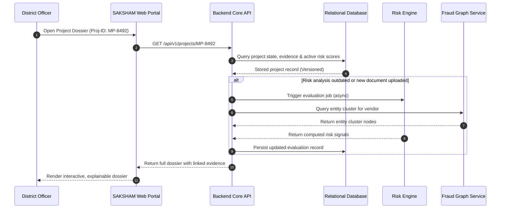

# Architecture Overview — SAKSHAM

## 1. System Mission & Boundary

SAKSHAM operates as an external intelligence, anomaly-detection, and risk-monitoring layer surrounding the MPLADS/e-SAKSHI ecosystem.

```
+-------------------------------------------------------------------------+
|                         e-SAKSHI Core Ecosystem                         |
|  (MP Recommendations, Administrative Sanctions, Contractor Billing,     |
|   Fund Disbursement, Fund Utilization Certificates)                     |
+-------------------------------------------------------------------------+
                                   ▲
                                   │ Read-Only Feeds / Audit Ingestion
                                   ▼
+-------------------------------------------------------------------------+
|                              SAKSHAM                                    |
|                   Intelligence & Monitoring Layer                       |
|                                                                         |
|  [ Ingestion & Normalization ] ──▶ [ Entity Resolution & Fraud Graph ]  |
|               │                                    │                    |
|               ▼                                    ▼                    |
|  [ Multi-Engine Analyzers ]    ──▶ [ Evidence & Investigation Engine ]  |
|  (OCR, CV, Geo, Vendor, Risk)                      │                    |
|               │                                    │                    |
|               ▼                                    ▼                    |
|  [ Decision Support & Dashboards ] ◀───────────────┘                    |
|  (Alerts, Anomaly Badges, Explainable AI Dossiers for Officers)          |
+-------------------------------------------------------------------------+
```

## 2. Core Architectural Tenets

1. **Database as Single Source of Truth**: Frontend never determines or recalculates analytical truths. State is queryable via stable REST/RPC interfaces.
2. **Deterministic Versioning**: All calculations are pinned to entity versions (e.g., `work_order_v1`, `mb_record_scan_v3`).
3. **Decoupled Analytical Services**: Heavy ML/OCR/CV/Graph workloads execute asynchronously behind durable queues, ensuring core portal responsiveness.
4. **Resilient Degradation**: If an AI microservice fails or is queued, existing evaluated data remains immediately accessible with transparent status indicators.

## 3. Component Breakdown

- **Frontend Client (`/frontend`)**: Responsive, mobile-first administrative portal built for field and desk officers. Strictly blue-and-white government aesthetic with semantic, restrained alert badges.
- **Backend Orchestrator (`/backend`)**: Central business logic, role-based access control, workflow tracking, and API coordination.
- **Analytical Services (`/services`)**:
  - `risk-engine`: Deterministic rule evaluations (split work orders, payment anomalies).
  - `fraud-graph`: Entity correlation graph (shared directors, circular bidding).
  - `ocr-service`: Optical character recognition and layout parsing for Measurement Books and invoices.
  - `cv-service`: Image authenticity and milestone verification from site inspection photos.
  - `llm-service`: Natural language investigative briefings grounded strictly in extracted evidence.
- **Database Layer (`/database`)**: Primary relational storage for transactional records, audit logs, and vector/graph projections.

## 4. Cross-Module Interactions



## 5. Implementation Constraints & Open Decisions

- **Constraint**: Strict operational isolation from direct database writes to live e-SAKSHI databases; communication is strictly read-only ingestion or webhook triggers.
- **Open Decision**: Balancing synchronous fast-path risk heuristics (< 200ms) with asynchronous deep visual/graph scans for high-value tenders (> ₹50 Lakhs).
