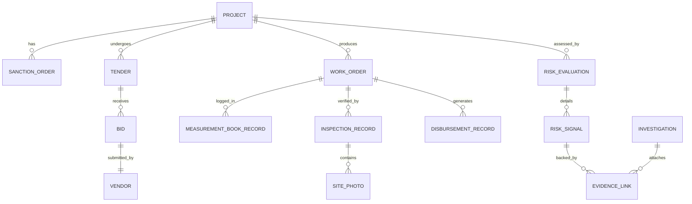

# Data Architecture & Entity Modeling — SAKSHAM

## 1. Purpose & Core Tenets

The data architecture provides a normalized, audit-compliant, and versioned schema representing the entities, operations, and analytical outputs of SAKSHAM.

The primary database serves as the absolute **Single Source of Truth**.

---

## 2. Entity Relational Model

---

## 3. Core Entities & Schema Definitions

### 3.1 `projects`
- `id`: UUID (Primary Key)
- `project_code`: String (Unique, e.g., `MP-UP-2024-00129`)
- `mp_name`: String
- `constituency_code`: String
- `district_id`: String (Foreign Key)
- `sanction_date`: Date
- `allocated_amount`: Decimal (INR)
- `status`: Enum (`RECOMMENDED`, `SANCTIONED`, `TENDERED`, `IN_PROGRESS`, `COMPLETED`, `HELD`)
- `created_at`, `updated_at`: Timestamp

### 3.2 `vendors`
- `id`: UUID
- `gstin`: String (Indexed)
- `pan`: String (Indexed)
- `company_name`: String
- `registered_address`: Text
- `bank_account_hash`: String (SHA-256 for privacy-preserving match)
- `director_dins`: Array[String]
- `longitudinal_risk_score`: Float [0.0 - 100.0]
- `blacklisted_status`: Boolean

### 3.3 `risk_evaluations`
- `id`: UUID
- `entity_type`: Enum (`PROJECT`, `VENDOR`, `TENDER`, `INSPECTION`, `PAYMENT`, `DOCUMENT`)
- `entity_id`: UUID
- `evaluation_version`: Integer
- `composite_score`: Float [0.0 - 100.0]
- `severity`: Enum (`LOW`, `MODERATE`, `HIGH`, `CRITICAL`)
- `computed_at`: Timestamp
- `is_latest`: Boolean

### 3.4 `risk_signals`
- `id`: UUID
- `evaluation_id`: UUID (FK to `risk_evaluations`)
- `signal_type`: String (e.g., `CARTEL_BIDDING_DETECTED`, `GEO_POLYGON_BREACH`, `STALE_PHOTO_REUSED`)
- `dimension`: Enum (`VENDOR`, `TENDER`, `PROJECT`, `INSPECTION`, `PAYMENT`, `DOCUMENT`)
- `weight`: Float
- `confidence_score`: Float [0.0 - 1.0]
- `explanation_summary`: Text

### 3.5 `evidence_links`
- `id`: UUID
- `risk_signal_id`: UUID
- `evidence_type`: Enum (`DOCUMENT_PAGE`, `IMAGE_COORDINATE`, `GEO_COORDINATE`, `TRANSACTION_HASH`, `GRAPH_EDGE`)
- `artifact_uri`: String (Internal storage path / hash)
- `metadata_json`: JSONB (Bounding boxes, lat/lon pairs, edge weights)
- `sha256_checksum`: String

### 3.6 `investigations`
- `id`: UUID
- `case_number`: String (Unique, e.g., `INV-2026-00412`)
- `project_id`: UUID
- `initiated_by_user_id`: UUID
- `case_status`: Enum (`OPEN`, `UNDER_REVIEW`, `SHOW_CAUSE`, `CLOSED_JUSTIFIED`, `CLOSED_SUBSTANTIATED`)
- `officer_notes`: Text
- `created_at`, `updated_at`: Timestamp

---

## 4. Immutability & Audit Trail

All tables containing risk signals and officer annotations incorporate immutable append-only logs. Changes to project statuses or alert dismissals produce records in an `audit_event_logs` table containing previous state, new state, user ID, client IP, and statutory reason.
