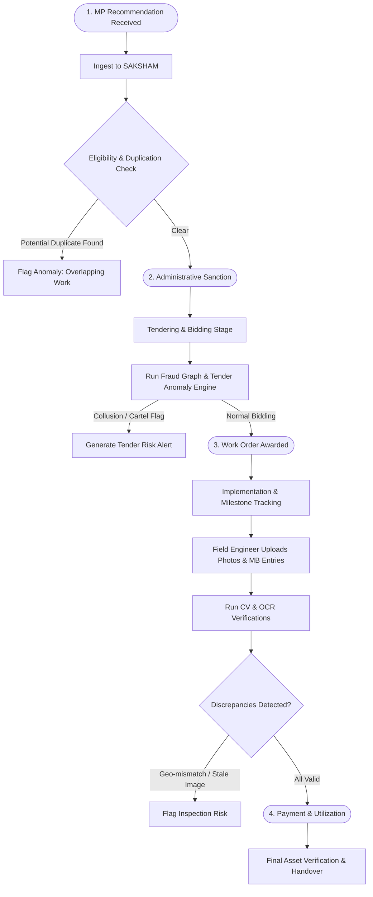

# Operational Workflows — SAKSHAM

## 1. Purpose

This document details the lifecycle workflows within SAKSHAM, showing how continuous monitoring and assistive risk intelligence integrate with standard MPLADS administrative milestones.

---

## 2. Core Workflows

### 2.1 Project Lifecycle & Risk Evaluation Workflow

### 2.2 Anomaly & Investigation Lifecycle

1. **Trigger**: An analytical engine (e.g. Tender Risk or OCR Mismatch) flags an anomaly score exceeding the sensitivity threshold.
2. **Alert Triaging**:
   - The alert appears on the District Nodal Officer's dashboard categorized by severity (`HIGH`, `MEDIUM`, `INFORMATIONAL`).
   - The system attaches the **Evidence Packet** (e.g., side-by-side photo comparison, matched contractor PANs, or MB calculation variance).
3. **Officer Review**:
   - **Scenario A: Verified Valid Work**: The officer reviews the site conditions, enters a statutory justification (e.g., "Site relocated 50m due to flood plain clearance by order #892"), and marks the alert as `RESOLVED_JUSTIFIED`.
   - **Scenario B: Suspicious Anomaly**: The officer escalates the item to a formal **Investigation Case**.
4. **Formal Investigation**:
   - System assigns a unique persistent ID: `INV-YYYYMMDD-XXXX`.
   - Freezes the relevant evidence snapshot.
   - Generates an executive briefing dossier for the District Magistrate / State Audit.
   - Tracks case status: `OPEN`, `UNDER_FIELD_INSPECTION`, `SHOW_CAUSE_ISSUED`, `CLOSED_SUBSTANTIATED`, `CLOSED_EXONERATED`.

---

## 3. Relationship with Other Modules

- **Risk Engine**: Produces the quantitative baseline triggers.
- **Investigation System**: Manages case status, officer notes, and evidence freeze.
- **Persistence & State**: Guarantees that active investigation states survive user logins, reloads, and browser crashes.
